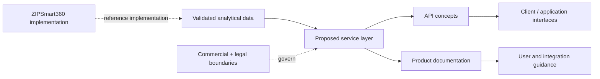

# ZIPSmart360-App

### Product Architecture · API Design · Technical Documentation

**A product-concept and documentation repository showing how ZIPSmart360 analytical capabilities were translated into proposed service interfaces, documentation, and product boundaries.**

[Working implementation](https://github.com/JJennings728/ZipSmart360) · [Portfolio](https://github.com/JJennings728/ZipSmart360/blob/main/PORTFOLIO.md)

## Overview

ZIPSmart360-App preserves early product architecture, API concepts, documentation structure, and commercial-design thinking developed around ZIPSmart360.

It is intentionally separated from the current executable implementation. The working software is maintained in [JJennings728/ZipSmart360](https://github.com/JJennings728/ZipSmart360).

## Product architecture



The repository documents the **product-design layer**; it does not claim that every proposed interface was deployed.

## What this repository demonstrates

- translating analytical capabilities into proposed service interfaces;
- API and product-concept development;
- technical documentation structure;
- separation of conceptual architecture from implemented behavior;
- commercial and legal boundary thinking; and
- traceable links back to the working implementation.

## Repository structure

```text
ZIPSmart360-App/
├── Product Documentation  # Historical product documentation
├── docs/                  # Supporting documentation
├── reference/             # Reference material
└── README.md              # Repository guide
```

## Setup and review

This repository is primarily documentation, so there is no standalone application to install.

### Clone the documentation repository

```bash
git clone https://github.com/JJennings728/ZipSmart360-App.git
cd ZipSmart360-App
```

The repository default branch is `v1.0`.

### Run the working implementation

For executable behavior, use ZIPSmart360:

```bash
git clone https://github.com/JJennings728/ZipSmart360.git
cd ZipSmart360

python -m unittest discover -s tests -v
python zipsmart.py
python server.py
```

Open:

```text
http://127.0.0.1:8000
```

## Relationship to ZIPSmart360

| This repository | ZIPSmart360 |
| --- | --- |
| Product concepts | Executable implementation |
| Proposed interfaces | Working local API |
| Documentation design | Runtime behavior |
| Commercial/product boundaries | Data validation and analytics |
| Historical architecture | Current tested reference |

## Design principle

A concept document should never be mistaken for implementation evidence.

For that reason, this repository explicitly distinguishes between:

- **proposed capability**;
- **documented architecture**; and
- **implemented, testable behavior**.

## Status

**Historical product-concept and documentation repository.**

Some materials describe endpoints, service features, or commercial structures that were not implemented as production functionality. For current behavior, use the [ZIPSmart360 README](https://github.com/JJennings728/ZipSmart360).

## Portfolio context

ZIPSmart360-App is part of a broader portfolio at the intersection of:

**data engineering · applied AI · insurance · risk analytics · decision-support systems**

[View the complete portfolio](https://github.com/JJennings728/ZipSmart360/blob/main/PORTFOLIO.md)

## Author

**James Jennings**  
Applied AI · Risk Analytics · Data Engineering · Insurance

[LinkedIn](https://www.linkedin.com/in/james-jennings-2053b4a8) · [GitHub](https://github.com/JJennings728)
